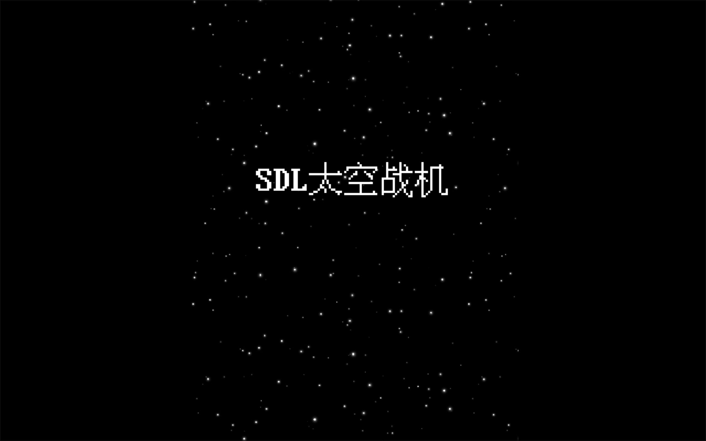
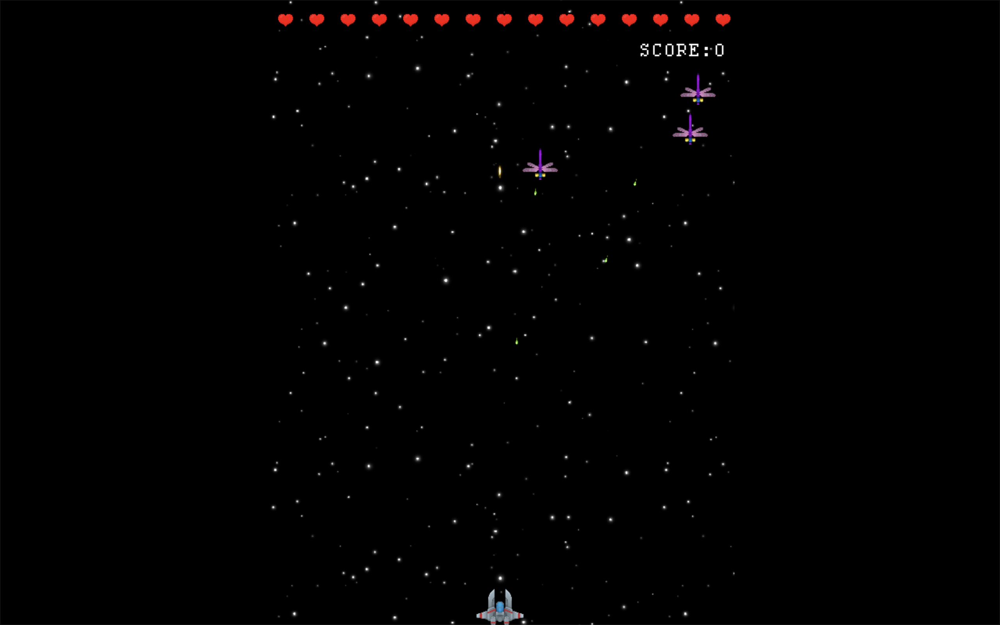
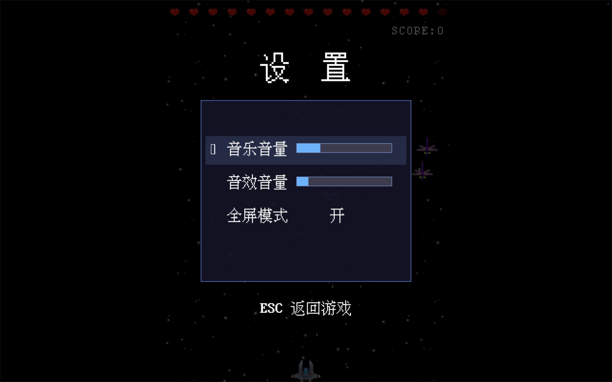

# SDL Shooter

A 2D shooting game built with C++ and SDL2.
一个使用 C++ 和 SDL2 开发的 2D 射击游戏。

This project is a personal learning project focused on:
这个项目主要用于学习：

- SDL2 game development      SDL2 游戏开发
- Scene management           场景管理（Scene System
- UTF-8 text input           UTF-8 中文输入处理
- Collision detection        游戏循环与碰撞检测
- CMake project structure    CMake 工程结构
- Game architecture in C++   C++ 面向对象设计

---

# Screenshot  游戏截图

---

# Features  功能
Player movement     玩家移动
Shooting system     射击系统
Enemy spawning      敌人生成
Scene switching     场景切换
UTF-8 text rendering/inputUTF-8  文本输入
Keyboard input handling          键盘输入系统
SDL2 rendering pipelineSDL2      字体渲染
Basic UI system     基础 UI

---

# Project Structure  项目结构
SDLShooter/
│
├── assets/        # textures/fonts/audio  图片/字体/音频资源
├── include/       # header files  头文件
├── src/           # source files  源代码
├── CMakeLists.txt
├── README.md
└── .gitignore
